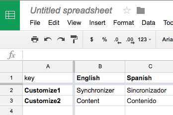

# SketchContentSync

Synchronize your content between google spreadsheets and Sketch.app.

Now supports both public and private google spreadsheets.

# Downloading & ContentSync Platform

Register for free at [www.contentsync.io](http://contentsync.io/) and get started easily.

# Features

### Content Synchronizing

Naming any text element with the format `sync:<key>` will synchronize its content. The content will be from the spreadsheet row where the first cell's content matches `<key>`.

### Content Localizing

Each row may have many columns. Before each sync you may select which column to populate content from. This supports having different versions or localizations of your content.

### Content Concatenating

A synchronized element's content can also be based on concatenating multiple `<key>`'s or constants. For example, you may use `sync:<key1> + <key2>` to generate content which is `<key1 value><key2 value>`. Furthermore you may concatente strings as well using `sync:<key1> + ' and ' + <key2>` which will result in the content `<key1 value> and <key2 value>`.

To add new lines between items, use `'\n'` for example `sync:<key1> + '\n' + <key2>`.

### Content wildcards

A synchronized element's content can be chosen by pattern. For example
if you have `<keys>` like `article1title` and `article2title`. You can
select randomly between these by using `sync:article*title`. 

### Symbol Content Overriding

Customize text per symbol instance. Naming a text element `sync:<key>` within a Symbol definition then naming the used symbol, you can then use the content key `<key>[<symbolname>]` within the spreadsheet to set the content for the text within that specific symbol instance.

[Learn more about symbol usage](./docs/symbols.md)

# How to Install It

Register for free at [www.contentsync.io](http://contentsync.io/) and get started easily.

# How to use it

## 1. Create Google Document

Create a google document with the content you want to use. The first column is the `[key]` of the content, and each column to the right is a translation / varition of that content.

## 2. Create text field(s)

Naming a text field with a name as `sync:[key]`, replacing `[key]` with the key used in the google document will cause it to be synchronized. Other text fields will be ignored.

## 3. Run ContentSync Sketch Plugin

## 4. If you are not logged in, it will redirect you.

## 5. After you create a free account, it will log in 

## 6. Now sync one more time and it will prompt for project

If you do not have any projects, go to [www.contentsync.io](http://contentsync.io/) and create one with the easy stepthrough.

## 6. Now sync one more time and it will prompt for project

## 7. Voila

